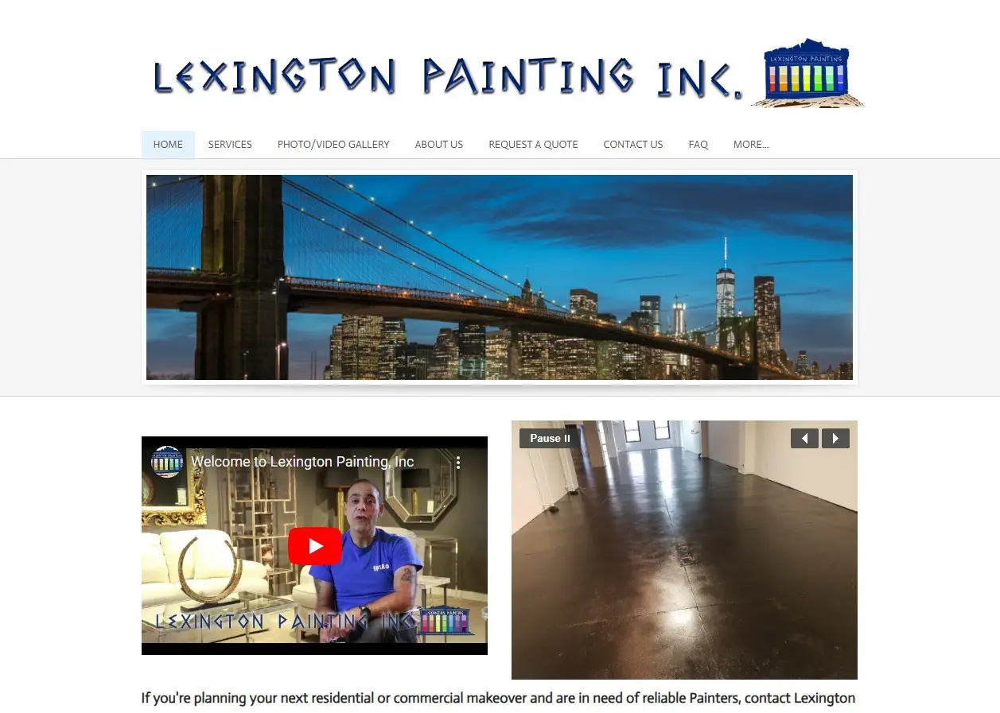

## File Structure

```
.
├── public/
├── src/
│ ├── _data/
│ │ └── client.js
│ ├── _includes/
│ │ ├── components/
│ │ └── layouts/
│ ├── assets/
│ │ ├── css/
│ │ ├── favicons/
│ │ ├── fonts/
│ │ ├── images/
│ │ ├── js/
│ │ └── sass/
| ├── config/
│ ├── content/
│ │ └── pages/
│ ├── _redirects
│ ├── index.html
│ ├── robots.txt
├── .eleventy.js
└── netlify.toml
└── package-lock.json
└── package.json
```

The documentation provides a detailed explanation of the starter kit's file structure. It describes the purpose of key files and directories, such as public/ (for built site files), src/ (where the site's source code resides), and node_modules/ (containing project dependencies). Essential files like .eleventy.js, which configures Eleventy, netlify.toml for deployment settings, and package.json for scripts and dependencies are highlighted. The structure also includes directories for assets, configuration, and content, each serving specific functions to streamline development and deployment processes.

## Before & After Image of Homepage




## Public URL

https://lexingtonpainting.netlify.app/
